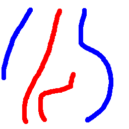
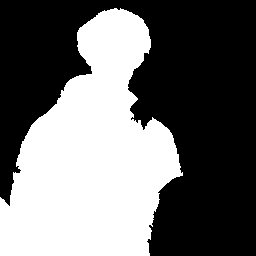

# HW4: Segmentation
Goal is to perform semi-automatic binary segmentation based on SLIC superpixels and graph-cuts:

## Procedure :

- Given an image and sparse markings for foreground and background
- Calculate SLIC over image
- Calculate color histograms for all superpixels
- Calculate color histograms for FG and BG (FG : Foreground, BG: Background)
- Construct a graph that takes into account superpixel-to-superpixel interaction (smoothness term), as well as superpixel-FG/BG interaction (match term)
- Run a graph-cut algorithm to get the final segmentation

- The code for the above implementation is [here](Source/main.py)

## Input:

### Input Main Image

]

### Input Markings Image

## Output: Binary Mask

## Interactive Binary Segmentation

- User can draw the markings
- Real time results for binary markings is shown
- code for interactive implementations is [here](Source/main_bonus.py)
- Sample demo is shown below

